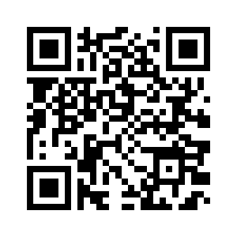

# app-parking

<p align="center">
  
 </p>

  -------
 > App web que simula o funcionamento de estacionamento.
A aplicação é dividida em duas partes: a primeira com o acesso do cliente e a segunda é a
gestão desses dados, onde é possível acompanhar o status do processo.
O intuito foi praticar interações no Vue.js com o "backend", utilizando rotas e
CRUD de forma simplificada.
>
> Projeto foi construído com fins didáticos, o objetivo é colocar os conhecimentos adquiridos em prática.
>


<p align="left">

</p>

## 💻 Tecnologia

* Principais tecnologias utilizadas:
  
  
  

* Toda aplicação foi criada no sitema operacional `Windows 11`

## 🚀 Instalação

Configurando projeto
```
npm install
```

Copilando para desenvolvimento
```
npm run serve
npm run backend
```
Copilando para produção
```
npm run build
```

Para mais informações sobre configurações  <a href="https://cli.vuejs.org/config/" target="_blank"><kbd>Configuration Reference</kbd></a>


## :man_technologist: Acessando o projeto

Para acessar o projeto é fácil: <a href="https://subtle-tarsier-4ce0a6.netlify.app" target="_blank"><kbd>click aqui</kbd></a> ou aponte seu celular | 
:--------- | :---------

## 📝 Licença

Esse projeto está sob licença. Veja o arquivo <kbd>[MIT](Mit.md)</kbd> para mais detalhes.
>
>
>
<p align="center">
  


**[⬆ voltar ao topo](#app-parking)**


